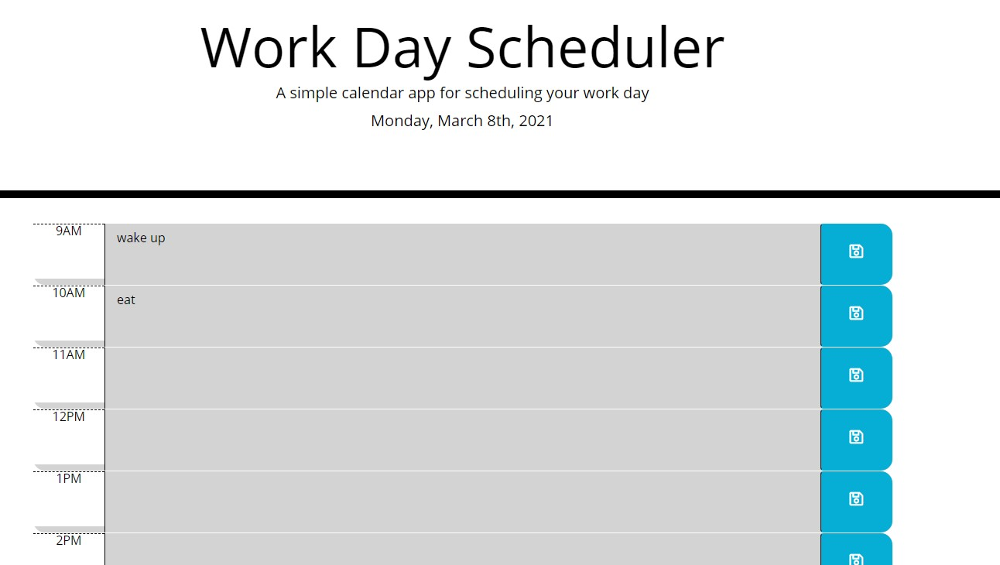

In this project, I created a calendar application that allows the user to save events for each hour of the day.  This app uses dynamically updated HTML and CSS powered by jQuery in order to display color coded timeblocks that indicate whether a timeblock is in the past, present or future.

